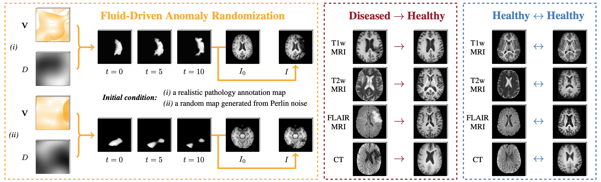
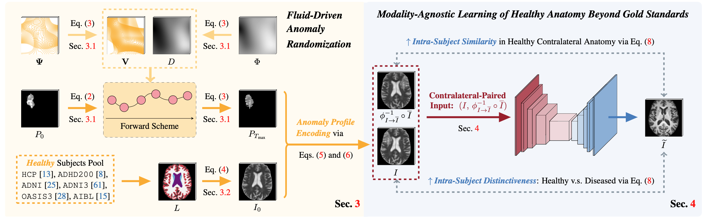

## <p align="center">[[CVPR 2025] Unraveling Normal Anatomy via Fluid-Driven Anomaly Randomization](https://arxiv.org/abs/2501.13370)</p>

**<p align="center">Peirong Liu<sup>1</sup>, Ana Lawry Aguila<sup>1</sup>, Juan E. Iglesias<sup>1,2,3</sup></p>**

<p align="center">
<sup>1</sup>Harvard Medical School and Massachusetts General Hospital<br />
<sup>2</sup>University College London &nbsp;&nbsp; <sup>3</sup>Massachusetts Institute of Technology
</p>


<p align="center">
  
</p>


## News

[08/09/2024] Check out our related ECCV'2024 work [here](https://github.com/peirong26/Brain-ID) on contrast-agnostic feature representations for learning anatomical features.

[06/17/2024] Check out our related MICCAI'2024 work [here](https://github.com/peirong26/PEPSI) on a contrastic-agnosic model for images with abnormalities with pathology-encoded modeling.


## Downloads
Please download UNA's weights ('./model/una.pth') and testing healthy and diseased images including both MRI and CT scans ('./data') in this [Google Drive folder](https://drive.google.com/drive/folders/1t6c1SpBbyuaecyNmxYh_ouQTcot_kkf-?usp=sharing), then move them into the './assets' folder in this repository. We also provided UNA's testing results for these testing samples in './results'.


## Environment
Training and evaluation environment: Python 3.11.4, PyTorch 2.0.1, CUDA 12.2. Run the following command to install required packages.
```
conda create -n UNA python=3.11
conda activate UNA

cd /path/to/una
pip install -r requirements.txt
```


## Demo


### Fluid-Driven Anatomy Randomization Generator


```
cd /path/to/una
python scripts/demo_generator.py
```
To visualize UNA's fluid-driven randomization process across time, set `save_orig_for_visualize` as `True` in `cfgs/generator/test/demo_generator.yaml`. 


### Healthy Anatomy Reconstruction


```python3
import os, sys
sys.path.append(os.path.dirname(os.path.dirname(os.path.abspath(__file__))))
root_dir = os.path.dirname(os.path.dirname(os.path.abspath(__file__)))
import torch
import utils.test_utils as utils 
from utils.misc import viewVolume, make_dir
device = torch.cuda.current_device() if torch.cuda.is_available() else 'cpu'


### Set Up Paths ###
model_cfg = os.path.join(root_dir, 'cfgs/trainer/test/test.yaml')
gen_cfg = os.path.join(root_dir, 'cfgs/generator/test/test.yaml') 
ckp_path = os.path.join(root_dir, 'assets/una.pth') 

test_case_dir = os.path.join(root_dir, 'assets/data/diseased-T1w-MRI') # try other provided testing images: diseased-FLAIR-MRI, diseased-CT, healthy-T1w-MRI, healthy-FLAIR-MRI, healthy-CT-MRI
test_save_dir = make_dir(os.path.join(root_dir, 'assets/results/diseased-T1w-MRI'), reset = False)


### Read Images ###
img_path = os.path.join(test_case_dir, 'input.nii.gz')
img_flip_reg2orig_path = os.path.join(test_case_dir, 'input_flip_reg2orig.nii.gz')


### Testing ### 
_, img, _, aff = utils.prepare_image(img_path, win_size = [160, 160, 160], im_only = True, device = device) 
_, img_flip_reg2orig, _, _ = utils.prepare_image(img_flip_reg2orig_path, win_size = [160, 160, 160], spacing = None, im_only = True, device = device)

outs = utils.evaluate_image(img, img_flip_reg2orig, ckp_path = ckp_path, device = device, gen_cfg = gen_cfg, model_cfg = model_cfg)
viewVolume(outs['T1'], aff, names = [ 'out_una' ], save_dir = test_save_dir)
```
You could also customize your own testing demo in `scripts/demo_test.py`. If you would like to test UNA on your own input images, please structure them in the same way as the example testing images in './assets/data' folder.


## Training on Synthetic Data and/or Real Data


<p align="center">
  
</p>

```
cd /path/to/una
python scripts/train.py una_generator una_trainer
```
We also support Slurm submission:
```
sbatch scripts/train.sh
```
The anomaly randomization setups are in `cfgs/generator/train/una_generator.yaml`, the training setups are in `cfgs/trainer/train/una_trainer.yaml`. For customized datasets, please set up their paths in the same way as examples in `Generator/constants.py`.


## Testing and Evaluation
Use the following code to test UNA on real data, using our provided weights: 
```
cd /path/to/una
python scripts/test.py
```
We also support Slurm submission:
```
sbatch scripts/test.sh
```
You could customize your own task by creating your own `yaml` under `cfgs/generator/test`, the default settings are in `cfgs/generator/default.yaml`.


To evaluate and plot the results, using:
```
cd /path/to/una
python postprocess/eval.py
python postprocess/plot.py
```


## Download the Public Datasets


- ADNI, ADNI3 and AIBL datasets: Request data from [official website](https://adni.loni.usc.edu/data-samples/access-data/).

- ADHD200 dataset: Request data from [official website](https://fcon_1000.projects.nitrc.org/indi/adhd200/).

- HCP dataset: Request data from [official website](https://www.humanconnectome.org/study/hcp-young-adult/data-releases).

- OASIS3 dataset Request data from [official website](https://www.oasis-brains.org/#data).

- ATLAS dataset: Request data from [official website](https://fcon_1000.projects.nitrc.org/indi/retro/atlas.html). 

- ISLES2022 dataset: Request data from [official website](https://www.isles-challenge.org/).

- Segmentation labels for data simulation: To train UNA model of your own from scratch, one needs the segmentation labels for synthetic image simulation. We obtained the brain anatomy labels via three steps:
     (1) Skull-strip: [SynthStrip toolbox](https://surfer.nmr.mgh.harvard.edu/docs/synthstrip/); 
     (2) Synthesize T1w: [SynthSR toolbox](https://surfer.nmr.mgh.harvard.edu/fswiki/SynthSR); 
     (3) Obtain anatomy segmentation labels: [SynthSeg toolbox](https://surfer.nmr.mgh.harvard.edu/fswiki/SynthSeg).


## Structure Customized Datasets
After downloading the datasets, please structure the data as follows, and set up your dataset paths in `Generator/constants.py`.
```
/path/to/dataset/
  T1/
    subject_name.nii.gz
    ...
  T2/
    subject_name.nii.gz
    ...
  FLAIR/
    subject_name.nii.gz
    ... 
  or_any_other_modality_you_have/
    subject_name.nii.gz
    ...
  label_maps_segmentation/
    subject_name.nii.gz
    ...
  pathology_maps_segmentations/
    subject_name.nii.gz
    ...
```


## Citation
```bibtex
@InProceedings{Liu_2025_UNA,
    author    = {Liu, Peirong and Aguila, Ana L. and Iglesias, Juan E.},
    title     = {Unraveling Normal Anatomy via Fluid-Driven Anomaly Randomization},
    booktitle = {IEEE/CVF Conference on Computer Vision and Pattern Recognition (CVPR)},
    year      = {2025},
}
